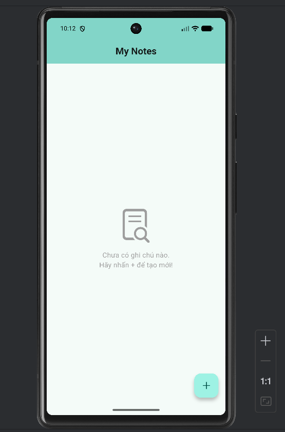
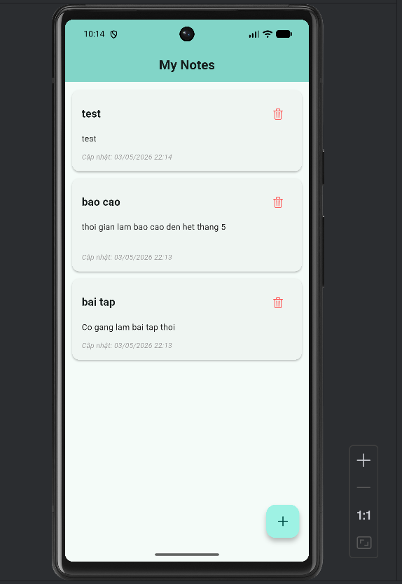
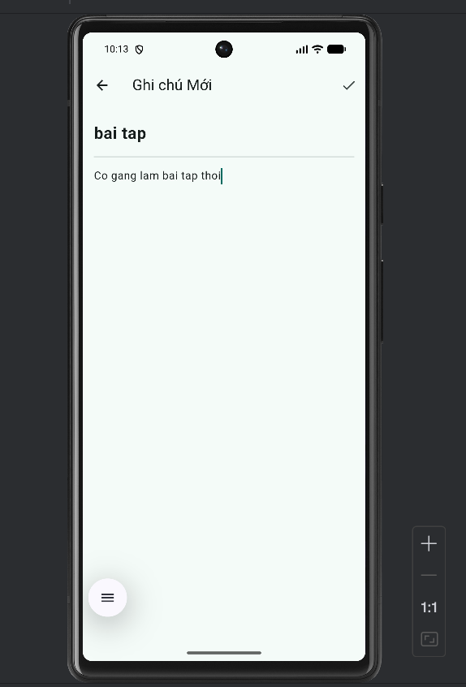
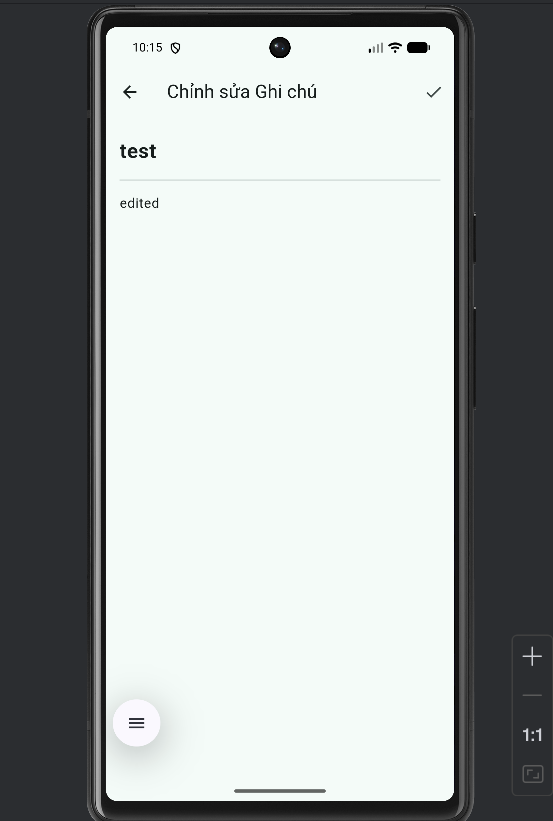
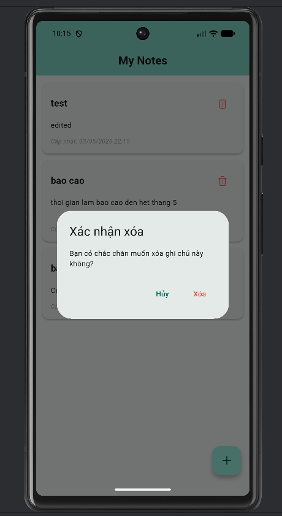

# Simple Note App

Một ứng dụng Flutter tối giản và mạnh mẽ để quản lý các ghi chú cá nhân của bạn. Dự án này thể hiện một kiến trúc phân lớp rõ ràng, quản lý trạng thái hiệu quả và lưu trữ dữ liệu cục bộ.

## Các tính năng chính

* **Thêm, Đọc, Sửa, Xóa (CRUD):** Toàn quyền kiểm soát các ghi chú của bạn.
* **Lưu trữ cục bộ:** Các ghi chú được lưu an toàn trên thiết bị của bạn bằng cách sử dụng `sqflite`.
* **Quản lý trạng thái:** Xử lý trạng thái phản ứng nhanh và hiệu quả với `provider`.
* **Giao diện thân thiện:** Màn hình chính (Home) và màn hình soạn thảo (Editor) trực quan cùng với widget thẻ ghi chú (Note Card) tùy chỉnh.
* **Kiến trúc phân lớp:** Cấu trúc mã nguồn dễ dàng mở rộng và bảo trì.

## Screenshots

* Màn hình Home chưa có note

* Màn hình Home có danh sách note

* Màn hình tạo note mới

* Màn hình sửa note

* Dialog xóa note

## Công nghệ sử dụng

* **Framework:** Flutter
* **Ngôn ngữ:** Dart
* **Cơ sở dữ liệu:** Sqflite
* **Quản lý trạng thái:** Provider

## Cấu trúc dự án

Dự án tuân theo kiến trúc phân lớp (layered architecture):

* `lib/models/`: Chứa các mô hình dữ liệu (`Note`).
* `lib/providers/`: Xử lý logic quản lý trạng thái (`NoteProvider`).
* `lib/screens/`: Các màn hình giao diện (`HomePage`, `EditorPage`, v.v.).
* `lib/widgets/`: Các thành phần giao diện có thể tái sử dụng (`NoteCard`, v.v.).
* `lib/database/`: Helper cơ sở dữ liệu cho các thao tác với SQLite.

